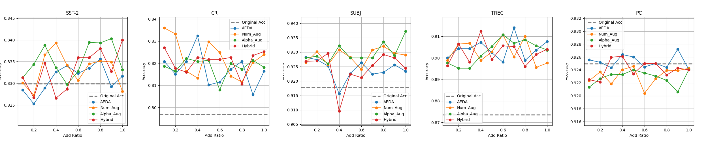
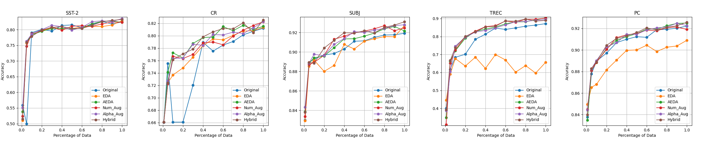
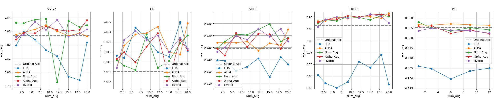

# Exploring Noise Injection for Text Classification

Building upon our comprehensive reimplementation of [AEDA: An Easier Data Augmentation Technique for Text Classification](https://arxiv.org/abs/2108.13230), we extended our inquiry into advanced data augmentation techniques for text classification in natural language processing (NLP). We explored the integration of **alphabet and numerical noise**, in addition to AEDA’s foundational technique of punctuation mark insertion. 

*To view information on AEDA Reimplementation, click [here](https://github.com/yoonichoi/aeda_reimplement/blob/master/Reimplementing-AEDA.md)*\
*To view our poster for the project, click [here](https://docs.google.com/presentation/d/1pMMEvN1McZyl2atmuSEe5w6ybc1326O54hHCtroOuf0/edit)*\
*To view our report on the project, click [here](https://drive.google.com/file/d/1dtYvTNoYE1oZFg77joMCdxGETfWbxZid/view?usp=sharing)*

---

### Repository Structure
```
├── aeda
├── code
├── data
├── experiments
│   ├── addratio_experiment
│   ├── bert
│   ├── increments_experiment
│   └── numaug_experiment
└── reproduce_fig2
```
- `aeda` and `data` are from the [original AEDA repo](https://github.com/akkarimi/aeda_nlp)
- `code` includes augmentation code you can apply on your own data
- `experiments` include code we used to run different experiments for our project. Refer to each folder's `README` for hyperparameter settings used
- `reproduce_fig2` is for our [AEDA reimplementation task]((https://github.com/yoonichoi/aeda_reimplement/blob/master/Reimplementing-AEDA.md))

### Results from our experiments

You can find individual plots with better resolution in `outputs/[runname]/plots` folder for each experiment
- Add Ratio Experiment

- Increments Experiment

- Number of Augmentations Experiment


---

### To run experiments
1. Set up requirements
```bash
pip install -r requirements.txt
```

2. Download `glove.840B.300d` to `word2vec/` folder
```bash
wget https://nlp.stanford.edu/data/glove.840B.300d.zip && unzip glove.840B.300d.zip
mkdir word2vec 
mv glove.840B.300d.txt word2vec/ && rm glove.840B.300d.zip
```

3. `cd` to the experiment folder you want to run. 
```bash
cd experiments/[experiment_folder]
```

4. Process data for training; this produces appropriate augmented data for the experiment, on top of the original training data. Refer to `data_process.py` to check which augmentations will be created.

```bash
python data_process.py
```

5. Run the experiments.
```bash
python train_eval.py --seed 0 --runname myrun
```

`train_eval.py` takes three arguments, `seed`, `runname` and `analyze`. If you don't specify `runname`, it will automatically save experiment results under a folder name with current time. 


6. (Optional) Run below command to create a figure based on the experiments result, specifying `runname` in `outputs/` that you want to create plots based on.
```bash
python plot_individual.py myrun
```
