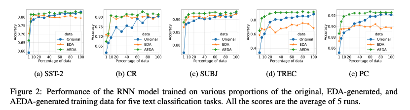

# Reimplemnting AEDA

This is the reimplementation code of Figure 2 in [AEDA: An Easier Data Augmentation Technique for Text Classification](https://arxiv.org/abs/2108.13230)

AEDA takes the baseline code from [EDA: Easy Data Augmentation techniques for boosting performance on text classification tasks](https://arxiv.org/abs/1901.11196) ([GitHub Link](https://github.com/jasonwei20/eda_nlp))



---

# Steps to reproduce results
1. Set up requirements
```bash
pip install -r requirements.txt
```

2. Download `glove.840B.300d` to `word2vec/` folder
```bash
wget https://nlp.stanford.edu/data/glove.840B.300d.zip && unzip glove.840B.300d.zip
mkdir word2vec 
mv glove.840B.300d.txt word2vec/ && rm glove.840B.300d.zip
```

3. Copy and organize `data` folder into `reproduce_fig2`, creating `train_orig.txt` and `test.txt` in each dataset folder

4. Process data for training; this is produce `aeda` and `eda` augmentation on top of the original training data. Refer to [Hyperparameters Used for Data Processing](https://github.com/yoonichoi/aeda_reimplement#hyperparameters-used-for-data-processing)

```bash
python reproduce_fig2/data_process.py
```

---

### Hyperparameters Used for data processing

| Hyperparameter   | EDA  | AEDA  |
|------------------|-----------|------------|
| alpha_sr         | 0.3       | -          |
| alpha_ri         | 0.2       | -          |
| alpha_rs         | 0.1       | -          |
| p_rd             | 0.15      | -          |
| punc_ratio       | -         | 0.3        |
| num_aug          | 9         | 9          |
